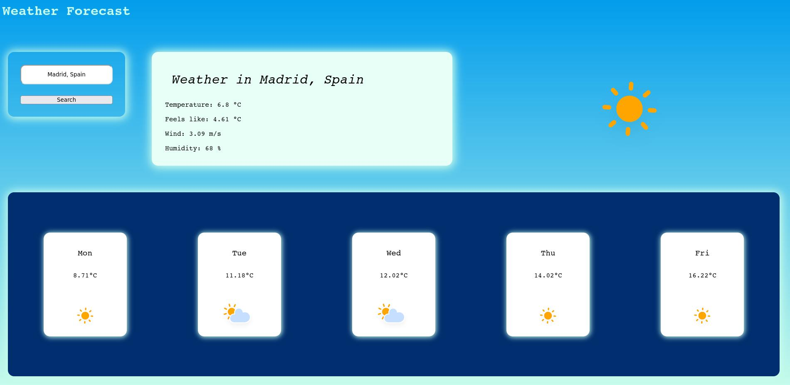

# weather-app

Weather application done with API.

You can have a look at the result <a href="https://budy6991.github.io/weather-app/">here</a>

# Assets

The weather icons were taken from <a href="https://www.amcharts.com/free-animated-svg-weather-icons/">ARMCHARTS</a>
